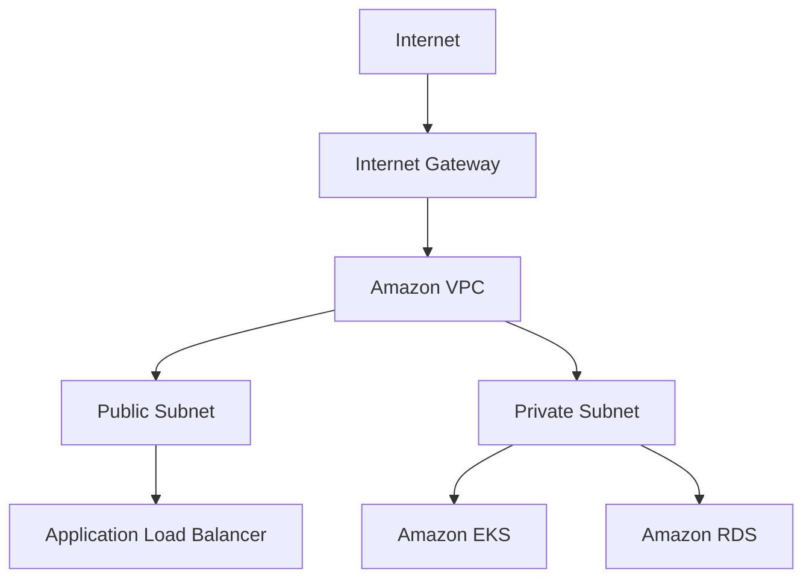

# Networking Layout

```mermaid
flowchart TD

Internet

IGW[Internet Gateway]

VPC[Amazon VPC]

Public[Public Subnet]

Private[Private Subnet]

ALB[Application Load Balancer]

EKS[Amazon EKS]

RDS[Amazon RDS]

Internet --> IGW

IGW --> VPC

VPC --> Public

VPC --> Private

Public --> ALB

Private --> EKS

Private --> RDS
```