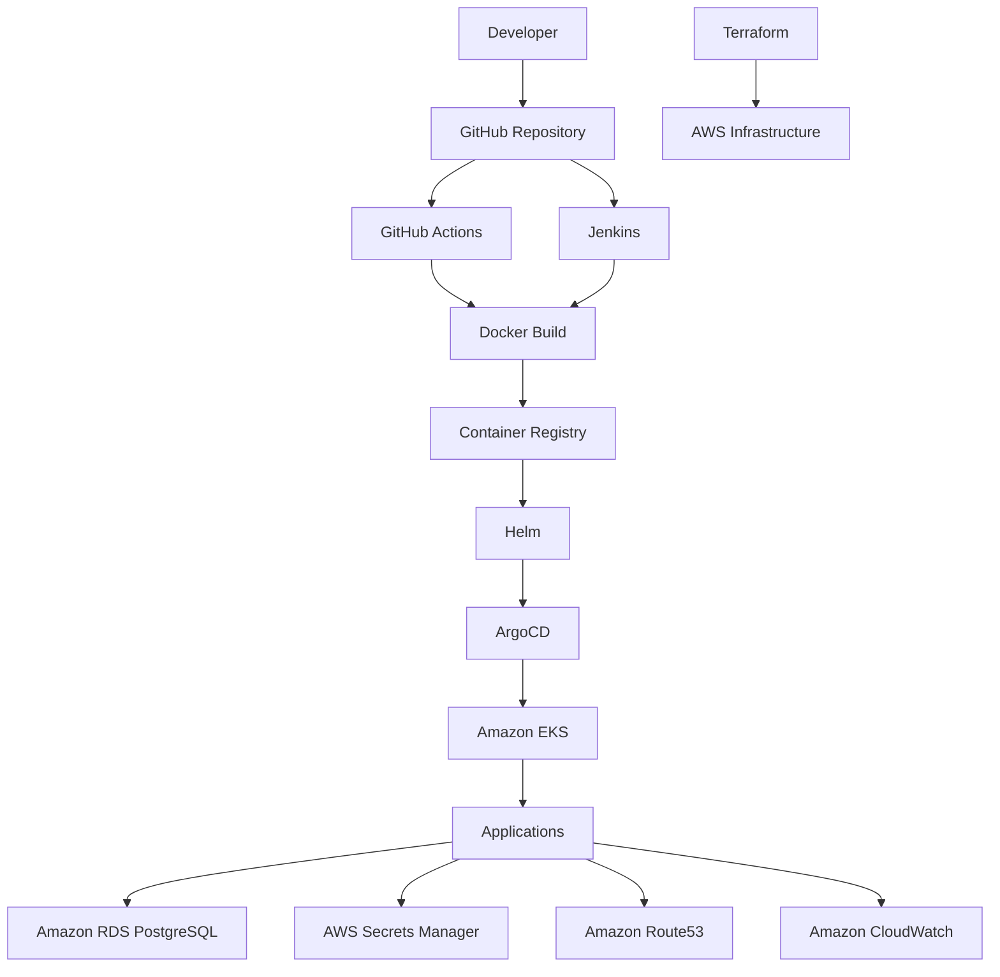

# Platform Architecture

```mermaid
flowchart TD

A[Developer]

B[GitHub Repository]

C[GitHub Actions]

D[Jenkins]

E[Docker Build]

F[Container Registry]

G[Terraform]

H[AWS Infrastructure]

I[Amazon EKS]

J[Helm]

K[ArgoCD]

L[Applications]

M[Amazon RDS PostgreSQL]

N[AWS Secrets Manager]

O[Amazon Route53]

P[Amazon CloudWatch]

A --> B
B --> C
B --> D
C --> E
D --> E
E --> F
G --> H
F --> J
J --> K
K --> I
I --> L
L --> M
L --> N
L --> O
L --> P
```